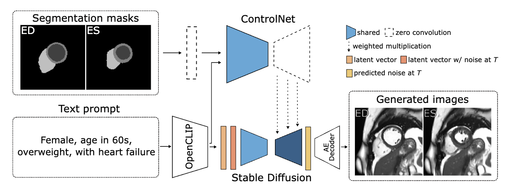
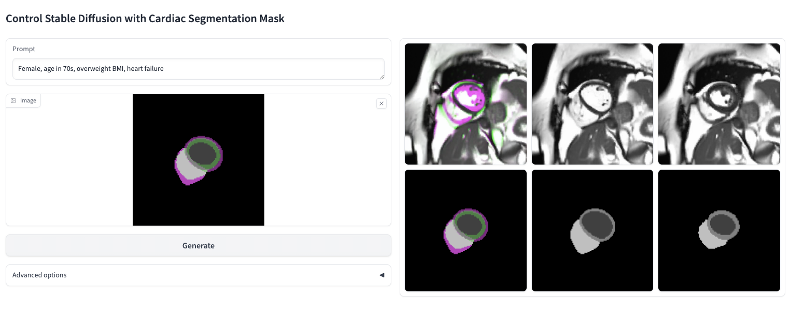

# Debiasing Cardiac Imaging Datasets with Controlled Latent Diffusion Models
Code repository for paper: Debiasing Cardiac Imaging Datasets with Controlled Latent Diffusion Models



Diffusion model training is based on a very well documented [ControlNet](https://github.com/lllyasviel/ControlNet) repo. 

## Setup
Create a new conda environment with
```
conda env create -f environment.yaml
conda activate debiasing-cardiac-mri
```

## ControlNet model training

Before training, ensure that the pretrained Stable diffusion 2.1 model is downloaded: 
["v2-1_512-ema-pruned.ckpt"](https://huggingface.co/stabilityai/stable-diffusion-2-1-base/tree/main)
After download, run
```
python tool_add_control_sd21.py
```
to attach the ControlNet branch to the vanilla Stable Diffusion model.


To train the Stable Diffusion model with ControlNet run:
```
python train.py
```

For more detailed instructions, go to (https://github.com/lllyasviel/ControlNet/blob/main/docs/train.md)

## Synthetic dataset generation
When your diffusion model fine-tuning is ready, you can generate the unbiased synthetic dataset with the following script
```
python generate_synthetic_dataset.py
```
You can choose one of the generation methods:
 - `generate_synthetic_copy` use real prompts and masks from the training dataset (used in the paper)
 - `generate_random_prompt_dataset` use randomly generated prompts and randomly selected masks from corresponding labels (e.g. healthy or heart failure)

 ## Interactive generation
 You can run a Gradio app to host your model and easily generate images with different prompts and masks.
 ```
 python gradio_mask2image.py
 ```



In this application, cardiac masks are stacked as RGB images, thus the raw output from the model is an RGB image as well. Two columns on the right display unstacked ED and ES frames.
